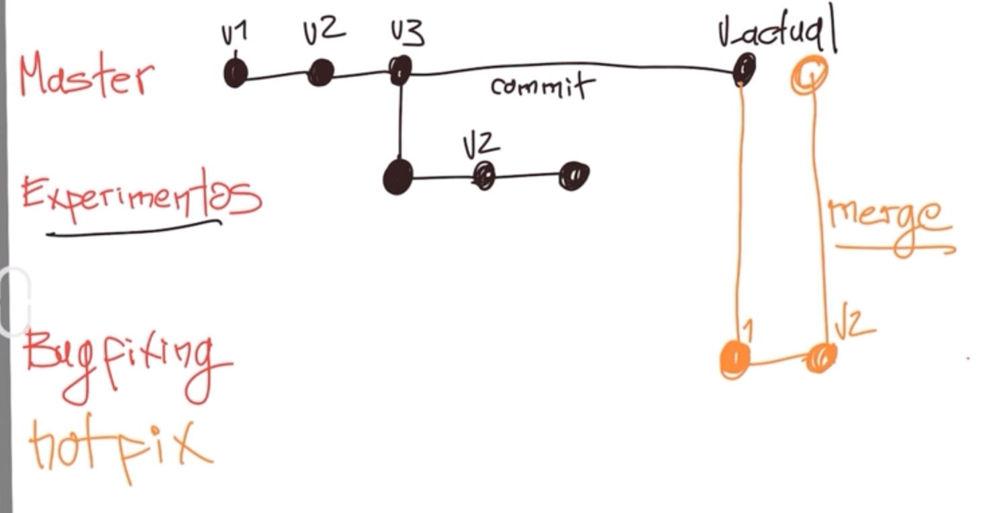

## Introduccion a Git

1. ```git init``` para iniciar el repositorio.
1. ```git status``` muestra el estado actual del repositorio.
1. ```git config -l``` para ver mi configuracion en git.
1. ```git add```  agrega cambios al área de preparación (staging area).
1. ```git commit -m "mensaje"``` confirmar los cambios que has agregado al área de preparación (staging area).
1. ```git log``` muestra el historial de commits de un repositorio.
1. ```git show```  se utiliza en Git para mostrar información detallada sobre un commit específico. Se puede utilizar este comando para ver los cambios introducidos en un commit.
8. ```git diff``` muestra las diferencias entre dos estados. 
9. ```git log --stat``` muestra los cambios especificos en los archivos apartir del commit
10. ```git commit -am "mensaje"``` implementa el **git add** pero solo funciona en archivos en los cuales ya se aplico **git add**

---
### Staging repositorio
> Staging es un area temporal antes de enviar los cambios al repositorio.

> es una area en memoria ram, que se encuentra desconectado de todo y se le agregan cambios mediante el comando ```git add```

> el comando ```git commit -m "mensaje"``` se envian los datos de staging al repositorio.

---

## git reset / git checkout

- Que hacer si debo regresar al estado anterior ?
> ```git reset``` permite deshacer cambios en el repositorio. 
> - ```git reset <commitHash> --hard```: todo vuelve al estado anterior.
> - ```git reset <commitHash> --soft```: vuelve al estado anterior, pero lo que se tiene en staging se mantiene.
>
> Tener cuidado con el hard.

> ```git checkout``` --> no me quedo tan claro
> - ```git checkout ramaPrincipal``` permite regresar a la rama principal o a la cabecera (al commit mas reciente)
> - ```git checkout commitHash ``` permite regresar a una version anterior. 
> 
> Tener cuidado

---
## Branch

* Cada vez que se realiza un commit, se crea una nueva version.
* Por lo general estamos en la rama **master**.
* Se puede crear ramas para **experimentos/development**.
* ```hotfix``` es una rama especial cuando se tiene un bug en la rama actual/principal, aqui se realiza los cambios y luego se fuciona con la rama actual, realizando un ```merge```.
* ```merge``` cuando se fucionan dos ramas. 


Main es la rama principal y el commit mas reciente es la cabecera (HEAD).
> **Nota:** cuando existe un error de detach HEAD, significa que estamos viendo un commit viejo, la forma de solucionar es aplicar ```git checkout main``` para regresar a la cabecera.


---

## Repositorio Remoto

* ```git clone url``` este comando trae un acopia del repositorio main a mi repositorio local.
* ```git push``` este comando permite enviar el cambio al servidor remoto.
* ```git fetch``` recupera cambios desde un repositorio remoto, pero no fusiona automáticamente esos cambios en tu rama actual.
* ```git merge``` este comando incorpora los los cambios en la rama actual.
* ```git pull``` recupera los cambios desde un repositorio remoto y fusionar automáticamente esos cambios en la rama local actual. Es una convinacion de git fetch y git merge.
